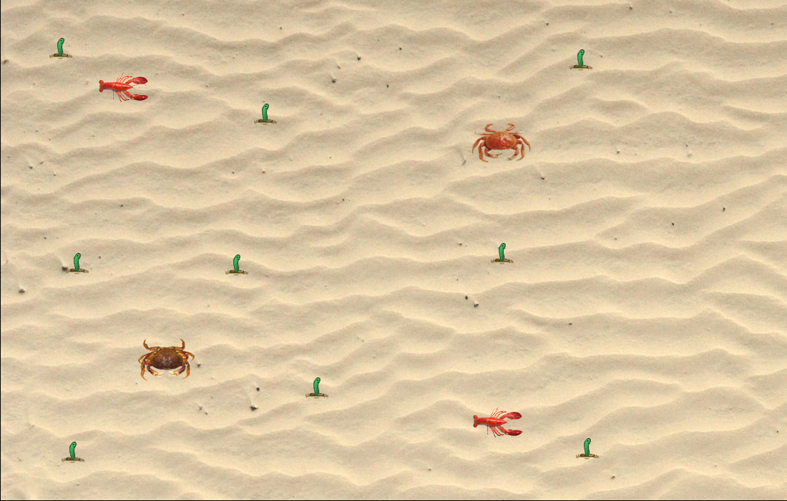
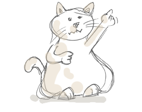
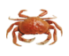
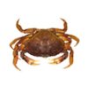
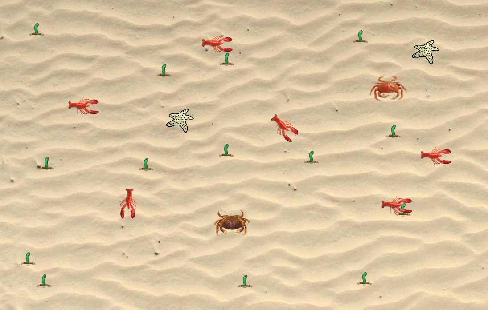
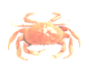
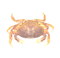

<h1 style="color:Navy;"><a id="Übe"><b>Stride Lernaktivitäten Krull+Tiedemann</b></a></h1>

Informatik bei Herrn Buhl, 2. Halbjahr 2016/17

<a href="https://laura-tiedemann.github.io/Stundenprotokoll.github.io/">Hier geht's zu unserem Stundenprotokoll!</a>

 
<h2 style="color:CadetBlue;"><b>Clash of Crabs</b></h2>

Bitte entnehmen Sie unser Spiel Clash of Crabs dem Informatikordner auf iSurfStormarn.

    
<h3 style="color:Navy;">Gliederung</h3>

<ul style="color:CadetBlue;">
      <li><a href="#Spi">1. Spielprinzip</a></li>
      <li><a href="#Zie">1.1 Ziel des Spiels</a></li>
      <li><a href="#Ste">1.2 Steuerung</a></li>
      <li><a href="#Ent">2. Spielentwicklung</a></li>
      <li><a href="#Ein">2.1 Greenfoot-Einstieg</a></li>
      <li><a href="#Ide">2.2 Ideen</a></li>
      <li><a href="#Imp">2.3 Implementierung</a></li>
      <li><a href="#Wei">3. Weitere Entwicklungsideen</a></li>
      <li><a href="#Neu">4. Neuerungen im 2. Halbjahr</a></li>    
    </ul>

<h3 style="color:Navy;"><a id="Spi">Spielprinzip</a></h3>

Schlüpfen Sie in die Rolle einer Krabbe am Sandstrand!

Es tummeln sich dort Würmer, Seesterne und Hummer. In einem ständigen Überlebens- und Konkurrenzkampf erleben Sie den ultimativen Adrenalinkick. Sie sind ständig auf der Suche nach leckeren Würmern. Doch nehmen Sie sich in Acht vor den sadistischen Hummern, die sich völlig unberechenbar bewegen und Ihnen während der Nahrungssuche nach dem Leben trachten. 
Ab und zu können Sie sich am Anblick äußerst dekorativer Seesterne beglücken.

Clash of Crabs ist zurzeit ein reines Multiplayerspiel.

<h4 style="color:CadetBlue;"> <a id="Zie">Ziel des Spiels</a></h4>

Überleben!

<h4 style="color:CadetBlue;"> <a id="Ste">Steuerung</a></h4>

Naturgetreue Darstellungen sind uns sehr wichtig. Daher bewegen sich die Krabben seitwärts fort. 
Die obere Krabbe (Player 1) wird mit Hilfe der Pfeiltasten gesteuert, die untere Krabbe (Player 2) mit w,a,s,d. Beide Krabben bewegen sich von allein, einzig die Richtungsänderung muss bestimmt werden.

<h3 style="color:CadetBlue;"> <a id="Ent">Spielentwicklung</a></h3>

Zuerst haben wir uns durch die Stride Lernaktivitäten gearbeitet, um uns einen ersten Einblick in die Programmiersprache Stride zu verschaffen. Dabei fiel uns vor allem das "Little Crab" Szenario ins Auge, welches unserer Meinung nach hohes Potenzial besitzt. Also haben wir uns die weiteren Informatikstunden dem "Little Crab" Szenario gewidmet, unsere eigenen Ideen eingebracht und es immer weiter verbessert, bis schließlich unser Spiel "Clash of Crabs" entstanden ist.

<h4 style="color:Navy;"> <a id="Ein">Greenfoot-Einstieg</a></h4>

Um einen ersten Einblick in Greenfoot zu bekommen, haben wir uns zunächst durch die Greenfoot-Stride-Lernaktivitäten gearbeitet. Das Meet-the-Greeps Szenario gab uns einen ersten Eindruck, wie Greenfoot aufgebaut ist und wie wir Befehle im Editor erstellen und verändern. Die Grundlagen der Tastatursteuerung sowie die Verwendung von Variablen haben wir so kennengelernt.  
Anschließend haben wir uns mit dem FatCat Szenario beschäftigt. Da wir die Befehle hierbei selbst erstellen sollten, haben wir uns mit den verschiedenen Hotkeys auseinandergesetzt und anschließend verschiedene Methoden ausprobiert. Das Endergebnis der tanzenden Katze war dabei ein großer Erfolg.

<h4 style="color:Navy;"> <a id="Ide">Ideen</a></h4>

Unsere erste Idee für eine Verbesserung bestand darin, Clash of Crabs zu einem Multiplayerspiel zu machen, da Multiplayerspiele sich generell einer hohen Beliebtheit erfreuen. Hierfür haben wir uns überlegt, dass die eine Krabbe mit den Pfeiltasten und die andere Krabbe mit w,a,s,d, gesteuert werden kann. Natürlich müssen sich die beiden Krabben auch optisch voneinander unterscheiden.

 

Des Weiteren haben wir die Grafiken etwas überarbeitet, da wir einen realistischeren Touch für das Spiel bevorzugen.
Einzig die Grafik der Würmer haben wir beim Alten belassen, um den Niedlichkeitsfaktor des Spiels beizubehalten.

Für die Hummer haben wir einen praktikablen Bewegungsablauf programmiert, der sie nach dem Zufallsprinzip über den gesamten Bildschirm laufen lässt. Zudem erscheinen nach einiger Zeit neue Hummer, sodass der Schwierigkeitsgrad erhöht wird. Sie erscheinen immer genau in der Mitte des Bildschirms, damit das Spiel für beide Spieler fair bleibt. 
Als letztes haben wir dem Spiel noch Sounds hinzugefügt: Eine chillige Beachmusic als Hintergrundmusik, um Strandflair zu kreieren, sowie einen hippen Sound, wenn eine der Krabben gefressen wird. Dieser gibt somit den Gewinner akustisch bekannt.

<h4 style="color:Navy;"> <a id="Imp">Implementierung</a></h4>

Um den zwei Krabben eine unterschiedliche Tastatursteuerung zu geben, haben wir mit Constructors gearbeitet. 
Dafür haben wir zunächst beim Actor "Crab" in "Fields" vier Variablen vom Typ String erstellt (keyUp, keyDown, keyLeft, keyRight). In "Constructors" haben wir dann für jede Krabbe vier Constructors (keyU, keyD, keyL, keyR), ebenfalls vom Typ String, erstellt. Darunter haben wir die vier Constructors definiert, und zwar als die vier zuvor erstellten Variablen. 
Dann haben wir eine Methode namens "TastatursteuerungCrab" erstellt und für jede Bewegungsrichtung unsere Variablen keyUp, keyDown, keyLeft und keyRight eingesetzt.

Anschließend haben wir in der CrabWorld "prepare"-Methode den beiden Krabben ihre unterschiedlichen Constructors 
(w,a,s,d bzw. die Pfeiltasten) zugewiesen. 
Nach demselben Prinzip haben wir beiden Krabben verschiedene Bilder zugewiesen.

Die alten Grafiken haben wir ausgetauscht, indem wir zunächst im Internet nach neuen, realitätsnäheren Grafiken gesucht haben. 
Anschließend haben wir diese einfach in den "Images" Ordner eingefügt und für die jeweiligen Actors unsere Grafiken ausgewählt.

Gleiches haben wir mit den Sounds gemacht. Diese haben wir ebenfalls im Internet gefunden, in den "Sounds" Ordner eingefügt und an den richtigen Stellen in unser Spiel einprogrammiert.

Der Bewegungsablauf der Hummer erfolgt nach dem Zufallsprinzip. Dies haben wir umgesetzt, indem  wir die Hummer konstant vorwärts laufen lassen und zufällig ("Greenfoot.getRandomNumber") deren Bewegungsrichtung mithilfe von "setRotation"  ändern. 
Mit den Wahrscheinlichkeiten haben wir so lange rumprobiert, bis die Hummer schließlich über den gesamten Bildschirm gelaufen sind.

Damit immer neue Hummer spawnen, haben wir in CrabWorld in "Fields" zuerst eine Variable vom Typ Integer erstellt ("zeitZumLobster") und diese auf 0 gesetzt. In der "act"-Methode der CrabWorld haben wir programmiert, dass die "zeitZumLobster" pro Tic um 1 erhöht wird und dass nach 600 Tics jeweils ein neuer Hummer in der Mitte der Welt gespawnt wird. Die "zeitZumLobster" wird anschließend wieder auf 0 gesetzt. 

Nach dem selben Prinzip haben wir auch immer neue Würmer und Seesterne spawnen lassen. Die "zeitZumWurm" haben wir auf 75 Tics festgelegt, damit diese stets vorhanden sind. Die Seesterne spawnen nach 1000 Tics, sodass das Treffen auf einen Seestern eine seltene Begegnung bleibt.

<h3 style="color:Navy;"> <a id="Wei">Weitere Entwicklungsideen (Stand 1. Halbjahr)</a></h3>

Wir haben noch viele weitere Ideen, um unser Spiel zu verbessern, die wir jedoch aufgrund Zeitmangels (noch) nicht umsetzen konnten. 
 Am wichtigsten wäre uns zunächst die Einblendung des Gewinners am Ende des Spiels. Hierfür haben wir bereits zwei Grafiken  erstellt ("Player 1 wins","Player 2 wins"). Leider ist es uns bisher nicht gelungen, diese ins Spiel zu integrieren. Die Schwierigkeit hierbei bestand vor allem darin, die jeweilige Grafik mit der betreffenden Krabbe zu verbinden.

Zudem sollte es zu Beginn des Spiels einen Titelbildschirm geben, in welchem man zwischen dem Multiplayer oder Singleplayer Modus wählen kann. Hierbei sollte auch eingeblendet werden, welche Krabbe zu welchem Spieler gehört und wie diese zu steuern sind.

Außerdem sollten die nährstoffreichen Würmer überlebenswichtig sein. Um nicht zu verhungern, müssten ca. 5 Würmer pro Minute gefressen werden. 
Dazu müssten im oberen Drittel des Bildschirms zwei Health Bars angezeigt werden, die kontinuierlich sinken und beim Verzehr von Würmern wieder partiell aufgefüllt werden. Dadurch entstünde ein Konkurrenzkampf zwischen den Krabben, der den Spielspaß erheblich steigern würde.

Des Weiteren sollten die überaus dekorativen Seesterne eine Funktion erhalten. Wir dachten an einen Super-Mario-inspired Seestern, der die Krabben temporär unsterblich macht. Außerdem kann die Krabbe durch ihre Superkraft die Hummer zerstören, wodurch das Gameplay erheblich verbessert würde und eine längere Spieldauer ermöglicht würde.
 

<h3 style="color:Navy;"> <a id="Neu">Neuerungen im 2. Halbjahr</a></h3>

Einige der oben genannten (Weiter-)Entwicklungsideen haben wir umgesetzt.

Zunächst wird der Gewinner nun am Ende des Spiels durch die Bilder "Player 1 wins" und "Player 2 wins" festgelegt. Dazu wurden beide Bilder den entgegengesetzen Krabben ("Player 1 wins" -> Krabbe 2/Player 2 und "Player 2 wins" -> Krabbe 1/Player 1)  zugeordnet. Diese Bilder wurden als Constructor "Image_3" definiert und wir haben den Befehl "setImage(Image_3)" in die "EatCrab-Methode" eingefügt. Die betreffende Krabbe wird, sobald sie vom Lobster gefressen wird, durch dieses Bild ersetzt. Das Bild wird zudem durch die Befehle "setRotation(0)" und "setLocation(int,int)" in der Mitte des Spielfelds positioniert.

Der Super-Mario-inspired Seestern wurde zudem eingefügt. Der Seestern spawnt automatisch wie oben beschrieben und wird bei Berührung mit den Krabben vom Bildschirm verschwinden (if "isTouching()"; "removeTouching()"). Um kenntlich zu machen, dass die Krabbe die Superkraft besitzt, wechselt zum einen das Bild der Krabbe stetig zwischen dem normalen und einem mit erhöhter Helligkeit. So sieht es aus, als ob die Krabbe leuchtet. Dies wird durch den Befehl  "if(getImage() == Image1) setImage(Image2) else(setImage(Image1))" erreicht. Am Ende wird das Bild durch "setImage(Image_1)" auf das Ursprungsbild zurückgesetzt.

 

Zum anderen wird eine Superkraft-Musik ("Greenfoot.playSound()") spielen. In dieser Superkraft-Zeit kann die Krabbe durch if"isTouching()";"removeTouching()" die Lobster fressen.
 

<audio id="superkraft" controls>
  <source src="audio/superkraft.mp3" type="audio/mpeg">
  Ihr Browser kann dieses Tondokument nicht wiedergeben.
</audio>

 

All dies passiert in einer neuen Methode, die nur aktiviert ist, wenn die Superkraft=true ist und durch die Fragemethode (public boolean; true/false) von den Lobstern abgefragt werden kann. Die Superkraft wird beim Aufeinandertreffen des Seesterns und einer Krabbe true gesetzt. Nach einer bestimmten Anzahl von Tics wird die Superkraft dann wieder false gesetzt, sodass die Krabben nun wieder von den Lobstern gefressen werden können.

<audio id="beachmusic" autoplay>
  <source src="audio/beachmusic_2.mp3" type="audio/mpeg">
  Ihr Browser kann dieses Tondokument nicht wiedergeben.
</audio>

 

<a href="#Übe">zum Seitenanfang</a>

